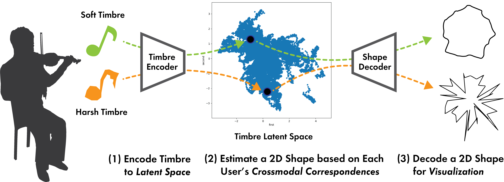

# TimToShape

TimToShape is a system designed to help musical instrument learners visualize and improve their timbre through intuitive 2D shape representations based on Crossmodal Correspondences.

Try a simple demo of our system at: https://arco0922.github.io/tim_vae_browser/
(Please use Chrome for the best experience.)



This work was accepted and presented at [ACM IUI (Intelligennt User Interface) Conference](https://iui.acm.org/2023/) in 2023.


## Implementation Details

This entire application is implemented using [Next.js](https://nextjs.org/).

Real time audio processing (e.g., FFT) is using [AudioWorkletProcessor](https://developer.mozilla.org/en-US/docs/Web/API/AudioWorkletProcessor), so that the audio processing does not block the main thread.

The processed audio is encoded into timbre latent space using VAE encoder. The VAE is pre-trained and real time inference is implemented using [Tensorflow.js](https://github.com/tensorflow/tfjs).

The shape drawing is implemented using [p5.js](https://p5js.org/).

## License

This project is licensed under the MIT License.


## Paper
Please refer to our paper for more details:

Kota Arai, Yutaro Hirao, Takuji Narumi, Tomohiko Nakamura, Shinnosuke Takamichi, and Shigeo Yoshida. 2023. TimToShape: Supporting Practice of Musical Instruments by Visualizing Timbre with 2D Shapes based on Crossmodal Correspondences. In Proceedings of the 28th International Conference on Intelligent User Interfaces (IUI '23). Association for Computing Machinery, New York, NY, USA, 850–865. https://doi.org/10.1145/3581641.3584053


```
@inproceedings{10.1145/3581641.3584053,
    author = {Arai, Kota and Hirao, Yutaro and Narumi, Takuji and Nakamura, Tomohiko and Takamichi, Shinnosuke and Yoshida, Shigeo},
    title = {TimToShape: Supporting Practice of Musical Instruments by Visualizing Timbre with 2D Shapes based on Crossmodal Correspondences},
    year = {2023},
    isbn = {9798400701061},
    publisher = {Association for Computing Machinery},
    address = {New York, NY, USA},
    url = {https://doi.org/10.1145/3581641.3584053},
    doi = {10.1145/3581641.3584053},
    booktitle = {Proceedings of the 28th International Conference on Intelligent User Interfaces},
    pages = {850–865},
    numpages = {16},
    keywords = {crossmodal correspondences, musical instrumental practice, timbre, timbre–shape correspondences, variational autoencoder},
    location = {Sydney, NSW, Australia},
    series = {IUI '23}
}
```
